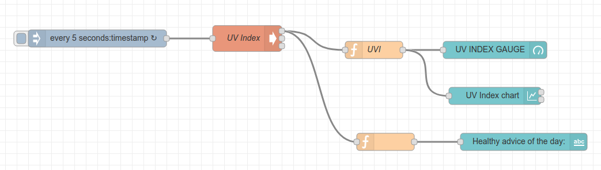
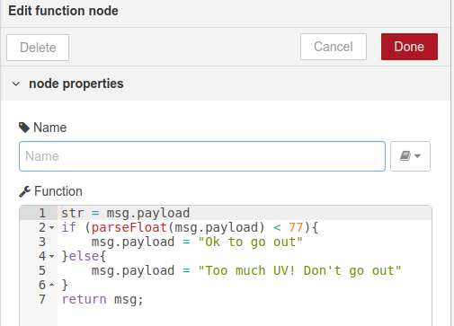
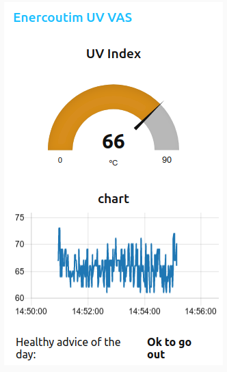

# Vicinity-ENERC-UVMeterKZ

The adapter bridges communication with Datalogger Datataker DT-80 located in Enercoutim's SolarLab, where the UV Meter from Kipp&Zonen will be deployed.  The K&Z UV meter will be connected to the DT-80 Datalogger and this adapter will get data from it and make it available to Vicinity. This sensor will be used to monitor UV Index in order to provide data that will be used by the "UV for citizens" Value-Added Service (VAS).

# 1. Infrastructure Overview
This is a Vicinity Adapter for ENERC Pilot Infrastructure. It is used to decribe the UV sensor connected to a Datataker DT-80 Datalogger located at the Enercoutim's SolarLab.  The K&Z UV sensor is not installed yet but currently there is already a weather station with several sensors that is connected to a DataTaker DT-80 Datalogger. Approach to retreive data when the sensor is connected will be the same as described here.

# 2 - Configuration and deployment

## Requirements
- JDK 1.8 or higher
- Python 2.7
- Node Red v0.18

## Device Specific Information
The Datataker DT-80 Datalogger collects all the data from any sensor connected to it and can send packaged data to an pre-configured FTP server. Collected Data can also be seen in a self-hosted webpage that contains a table with all the values (http://10.10.10.161/html/channels.shm from the local network). In order not to interfere with the current configuration of the datalogger and to get real-time data streaming a choice was made to extract data from the table.

A Raspberry Pi located in the same network and running Raspbian with Node-Red will perform the following actions:
####
1. Every X seconds a Node Red trigger node triggers an Exec node which runs a Python script that requests the HTML code located in http://10.10.10.161/html/channels.shm. See example Node Red Flow below.

2. The same Python script parses the HTML code using BeautifulSoup to retrieve the desired value and returns the desired value to Node Red. [script to be uploaded]
3. 3. A function node takes a value and performs all UV VAS Logic

4. 4. Dashboard nodes will be used to build an initial version of the VAS UI.

This same Raspberry Pi will be running Vicinity Gateway and Agent. An HTTP Request Node on NodeRed will be able to make GET and POST Requests to Vicinity using basic authentication.

# 3 - Functionality and API

## Endpoints
- GET /objects (optional): Retrieve all devices Thing Descriptions (TDs) for registration to VICINITY. This functionality is optional since auto-registration of devices will be performed.
- GET /objects/{oid}/properties/{pid} - Returns last known value and time the value was received by the device. {oid} is UUID of device and {pid} is a property identifier.

## Functions
- Send device TD to the Vicinity Agent at Start Up
- Publish every new measurement to a specific Vicinity event topic.

